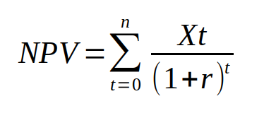

# NPV Calculator
This python application is a small program that calculates the net present value of cash flows of the life of a project. 
  

## Net Present Value
The net present value is a formula that takes the cash flows earned from a project over each year and discounts each amount by an interest rate to calculate a total net present value amount, being the total value today of future cashflows minusing the initial investment.